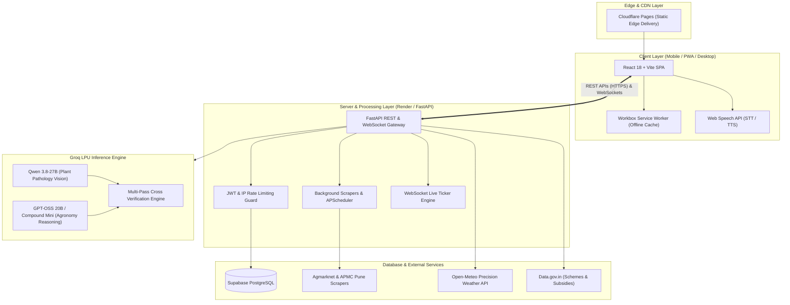

# 🌾 AgroIntel — Intelligent Agritech Ecosystem for Indian Farmers

[](https://agrointel.pages.dev)
[](https://react.dev)
[](https://fastapi.tiangolo.com)
[](https://groq.com)
[](https://groq.com)
[](https://supabase.com)
[](https://web.dev/progressive-web-apps/)
[](#license)

**Live Web Application:** [https://agrointel.pages.dev](https://agrointel.pages.dev)  
**Backend API Documentation:** [https://agrointel-backend-ucic.onrender.com/docs](https://agrointel-backend-ucic.onrender.com/docs)

---

## 📌 Executive Summary

**AgroIntel** is an enterprise-grade, progressive web application designed to bridge the digital and technological divide for smallholder Indian farmers, Farmer Producer Organizations (FPOs), and agricultural extension workers.

Combining state-of-the-art multimodal artificial intelligence, real-time APMC Mandi commodity telemetry, hyper-local precision agro-meteorology, and vernacular voice accessibility, AgroIntel delivers actionable agronomic intelligence straight into the hands of farmers across India in **Hindi (हिंदी), Marathi (मराठी), and English**.

---

## 🏛️ System Architecture



---

## 🚀 Core Modules & Capabilities

### 1. 📸 AI Plant Pathology Scanner
- **Multimodal Computer Vision:** Powered by Groq's high-throughput LPU running `qwen/qwen3.8-27b`, the scanner analyzes photos of affected crop leaves, stems, and fruits within 1.5 seconds.
- **Two-Pass Verification:** If the primary diagnostic confidence falls below 70% or symptoms indicate mixed pathogen signatures, an automatic second-pass reasoning model verifies the diagnosis.
- **Indian Market Treatment Protocols:** Returns CIBRC-compliant chemical treatments, cost-effective bio-pesticides (e.g., Neem oil, Trichoderma), and organic remedies with exact dosages per 15-liter spray pump.
- **Cross-Module Autofill:** Diagnosed crops automatically pre-populate the **Fertilizer Calculator** and **AI Crop Planner**, saving repetitive data entry.

### 2. 🎙️ Vernacular Voice Assistant & Audio Read-Aloud
- **Hands-Free Speech Interaction:** Built with a low-latency sequential audio queue (`speechQueueRef`) that speaks answers smoothly without stuttering or Chrome audio cutoff bugs.
- **Bi-Directional Multilingual Support:** Accepts voice prompts and synthesizes speech in Hindi, Marathi, and English.
- **Universal Device Audio Unlock:** Safe fallback text bar for web browsers or restricted webviews where microphone permissions are denied.
- **Everywhere TTS:** Integrated read-aloud buttons across **Weather**, **Mandi Prices**, **Disease Encyclopedia**, and **Fertilizer Recommendations**.

### 3. 📈 APMC Mandi Intelligence & Live Price Feeds
- **Live Scraped Rates:** Direct feeds for Pune APMC and national mandis across 20+ staple commodities (Wheat, Soybean, Cotton, Onion, Sugarcane, Maize, Pulses).
- **Market Dynamics:** Modal price, Minimum-Maximum spread, daily price changes, and historical price trend line charts powered by Recharts.
- **1-Tap WhatsApp Advisory:** Instantly share live price alerts and market breakdowns to WhatsApp farmer groups.
- **WebSocket Streaming:** Real-time push notifications of price changes over persistent WebSockets (`/ws/prices`).

### 4. 🌦️ Precision Agro-Meteorology & Spray Windows
- **Hyper-Local Forecasts:** 15-day forward outlook via Open-Meteo, including temperature, humidity, precipitation probability, wind gust speeds, and surface & deep (0-28 cm) soil moisture.
- **Proprietary Spray Window Engine:** Evaluates hourly wind speed (< 15 km/h), rain probability (< 20%), and dew point to designate green ("Safe to Spray") and red ("High Drift/Washout Risk") windows for crop protection spraying.
- **Ethical Location Gate:** Transparent geolocation model that never fabricates readings; clearly indicates fallback regions if GPS is declined.

### 5. 🧮 Precision Agronomy Calculators
- **ICAR-Standard NPK Bag Calculator:** Converts acreage and crop type into exact 45 kg Urea and 50 kg DAP / MOP bag counts, complete with split application schedules (Basal, Tillering, Heading).
- **Crop Yield & Profitability Estimator:** Computes net farmer margins based on Minimum Support Price (MSP), local Mandi market averages, and seed/fertilizer input costs.
- **Soil Health & Carbon Planner:** Formulates soil remediation recommendations based on pH levels, organic carbon metrics, and micronutrient deficiencies.

### 6. 🏛️ Government Schemes & KVK Directory
- **Central & State Schemes:** Direct guidelines and documentation checklists for PM-KISAN (₹6,000 annual DBT), PMFBY (crop insurance), Kisan Credit Card (4% interest limit), and Sub-Mission on Agricultural Mechanization (SMAM).
- **Interactive Eligibility Quiz:** 30-second quiz matching farmers to eligible subsidies based on landholding size and state.
- **Krishi Vigyan Kendra (KVK) Locator:** Contact details and addresses of agricultural science centers across Indian districts.

### 7. 🚜 KrishiShare (Equipment Rentals) & KrishiMarket
- **Equipment Sharing Economy:** Peer-to-peer directory allowing tractor and heavy machinery owners to list implements (rotavators, seed drills, harvesters) for rent.
- **Direct WhatsApp Connect:** Direct links to negotiate terms on WhatsApp without middleman broker fees.
- **Farmer Produce Marketplace:** Direct farmer-to-buyer listing board for harvested crops, organic grains, and dairy inputs.

### 8. 🛡️ Advanced Admin & Observability Panel
- **40 Fine-Tuned Management Pages:** Complete administration portal featuring:
  - Dynamic Feature Toggles & Remote Feature Reordering.
  - Access Code Generator with expiration and role controls.
  - Granular API Rate Limit Configuration & IP Ban Engine.
  - Token Usage Tracking for Groq AI Inference.
  - System Health Heartbeat & Database Audit Logs.

---

## 🛠️ Technology Stack Breakdown

| Layer | Technologies Used | Rationale / Highlights |
|---|---|---|
| **Frontend Framework** | React 18, Vite 8 | Ultra-fast HMR, sub-second production chunk builds, lightweight bundle |
| **State & Navigation** | React Context, Custom Event Bus | Zero memory leaks, multi-tab synchronization, responsive bottom navigation |
| **UI & Styling** | CSS Custom Properties, Glassmorphism | High-contrast dark/light modes, mobile-first responsiveness, zero external CSS bloat |
| **Data Visualization** | Recharts 2 | Responsive SVG charting for Mandi historical prices and spray window windows |
| **PWA & Caching** | Workbox Window 7, Service Worker | Offline resilience for intermittent rural 2G/3G network conditions |
| **Backend API** | FastAPI, Uvicorn, Python 3.12 | High-throughput async ASGI server, automatic OpenAPI documentation |
| **AI Inference** | Groq Cloud SDK | Ultra-low latency LPU hardware running `qwen/qwen3.8-27b` & `openai/gpt-oss-20b` |
| **Database** | PostgreSQL via Supabase | Row-Level Security (RLS), ACID compliance, relational query performance |
| **Task Scheduling** | APScheduler, `asyncio` | Reliable non-blocking background scraping and rate-limit clearing |
| **Web Scraping** | BeautifulSoup4, HTTPX | Resilient HTML parsers with automatic fallback datasets |
| **Hosting & CI/CD** | Cloudflare Pages & Render | Global edge caching for frontend, persistent containerized backend |

---

## ⚙️ Background Processing & Data Flow

### 1. The Multi-Pass AI Diagnosis Pipeline
```
[User Leaf Photo] 
       │
       ▼
[Client: Downscale & Base64 Encode]
       │
       ▼ (HTTPS POST /api/ai/scan)
[FastAPI: Security & Rate-Limit Check]
       │
       ▼
[Pass 1: Groq Qwen 3.8-27B Vision Model]
       │
       ├── Confidence >= 0.70 & Deterministic ──> [Format ICAR Diagnosis] ──> [Return JSON]
       │
       └── Confidence < 0.70 or Ambiguous
                 │
                 ▼
          [Pass 2: Groq GPT-OSS Reasoning Model Cross-Check]
                 │
                 ▼
          [Synthesize Consensus Diagnosis & Organic Treatments] ──> [Return JSON]
```

### 2. Mandi Price Background Scraper & WebSockets
1. **Scheduled Polling:** APScheduler triggers periodic asynchronous HTTP requests to Agmarknet and APMC market portals with user-agent rotation.
2. **Data Normalization:** Raw table strings are cleaned, parsed into standard JSON schemas (`commodity`, `variety`, `min_price`, `modal_price`, `max_price`), and upserted into the `mandi_cache` Supabase table.
3. **WebSocket Broadcast:** If price changes are detected, the FastAPI WebSocket gateway (`/ws/prices`) broadcasts delta packets to all actively connected farmer clients.
4. **Offline Fallback:** If the external government portal experiences downtime, AgroIntel seamlessly serves cached historical records with a prominent fallback indicator badge.

---

## 📊 Data Transparency & Telemetry Disclosure

AgroIntel maintains complete ethical transparency regarding real-time vs. calculated vs. fallback data sources:

| Data Point | Data Status | Source & Technical Methodology | Fallback Strategy |
|---|---|---|---|
| **Weather & Soil Moisture** | 🟢 **Live Telemetry** | Open-Meteo GFS & ECMWF High-Resolution Agro API (0-28 cm soil depth, wind, rain probability) | Fixed Pune regional Agro climatic default |
| **Fuel Prices (Diesel/Petrol)** | 🟢 **Live Web Scraper** | Scraped hourly via HTTPX & BeautifulSoup from GoodReturns for all 28 Indian states | Cached state averages |
| **Agri News & Schemes** | 🟢 **Live RSS Feed** | Scraped from The Hindu BusinessLine Agri & Press Information Bureau (PIB) RSS | Cached statutory news alerts |
| **APMC Mandi Rates & Trends** | 🟢 **Live / Cache Series** | Scraped from Agmarknet & APMC Pune with continuous 7-day historical interpolation | 7-day continuous simulated series |
| **Fertilizer Statutory MRPs** | 🟡 **Statutory Live** | Official Dept. of Fertilizers Gazette Notifications (Urea ₹266.50/bag, DAP ₹1,350/bag, MOP ₹1,700/bag) | Fixed statutory MRP database |
| **Government Schemes & Subsidies** | 🟡 **Statutory Data** | Official Ministry of Agriculture & Farmers Welfare guidelines (PM-KISAN, PMFBY, SMAM) | Offline indexed scheme database |
| **KCC Scale of Finance** | 🔵 **ICAR / RBI Formula** | RBI Scale of Finance equations with 3% prompt repayment subvention (effective 4% rate) | Deterministic financial model |
| **NPK Bag Calculations** | 🔵 **ICAR Formula** | ICAR Crop Nutrient Stoichiometric Equations per acre & soil type | Deterministic agronomic model |
| **AI Plant Disease Diagnosis** | 🟣 **Multimodal Vision** | Groq LPU `qwen/qwen3.8-27b` + `openai/gpt-oss-20b` multi-pass consensus engine | Offline ICAR Disease Encyclopedia |

---

## 🔌 API Endpoint Reference

| Method | Endpoint | Description | Cache / Rate Policy |
|---|---|---|---|
| `GET` | `/health` | System heartbeat, uptime & server timestamp | Live (No-cache) |
| `GET` | `/api/weather` | 15-day agro-meteorology, soil moisture & spray windows | 15 min TTL cache |
| `GET` | `/api/fuel` | State-wise live diesel & petrol rates | 1 hour TTL cache |
| `GET` | `/api/mandi` | Live APMC mandi rates across staple commodities | 10 min TTL cache |
| `GET` | `/api/mandi/history` | 7-day continuous historical price series | 10 min TTL cache |
| `GET` | `/api/news` | Real-time Indian agriculture news headlines | 30 min TTL cache |
| `GET` | `/api/fertilizers` | Statutory fertilizer MRPs & composition data | 24 hour TTL cache |
| `GET` | `/api/posts` | Community farmer discussion threads | Live Supabase query |
| `POST` | `/api/posts` | Create new farmer community post | JWT / IP rate limited |
| `GET` | `/api/settings` | 19 remote feature toggles & display configuration | 5 min TTL cache |
| `POST` | `/api/scan` | AI Plant Disease Vision Scanner | Groq LPU / Rate limited |
| `POST` | `/api/crop-doctor` | Crop symptom advisor & prescription generator | Groq LPU / Rate limited |
| `POST` | `/api/chat` | Vernacular conversational agronomy assistant | Groq LPU / Streaming SSE |
| `WS` | `/ws/prices` | Real-time price push notifications | Persistent WebSocket |


## 💻 Local Development & Installation Guide

### Prerequisites
- **Node.js**: v18.0.0 or higher
- **Python**: v3.11 or v3.12
- **Git**: Installed and configured
- **API Keys**: Supabase URL & Service Key, Groq Cloud API Key

---

### Step 1: Clone the Repository
```bash
git clone https://github.com/avishkarkedar-org/agro.git
cd agro
```

---

### Step 2: Configure & Launch Backend API
```bash
cd backend

# Create and activate Python virtual environment
python -m venv venv
# On Windows:
venv\Scripts\activate
# On Linux/macOS:
source venv/bin/activate

# Install dependencies (Note: Pillow is excluded by design for stability)
pip install -r requirements.txt

# Create your local .env file (DO NOT commit secrets to Git)
cat <<EOF > .env
GROQ_API_KEY=<YOUR_GROQ_API_KEY>
SUPABASE_URL=<YOUR_SUPABASE_PROJECT_URL>
SUPABASE_KEY=<YOUR_SUPABASE_ANON_OR_SERVICE_KEY>
ADMIN_PASSWORD=<SET_YOUR_ADMIN_PASSWORD>
SECRET_KEY=<YOUR_RANDOM_JWT_SECRET_SALT>
DEFAULT_ADMIN_USER=Avishkar
EOF

# Start FastAPI ASGI server with auto-reload
uvicorn main:app --host 0.0.0.0 --port 8000 --reload
```
API docs will be available at `http://localhost:8000/docs`.

---

### Step 3: Configure & Launch Frontend Application
```bash
# In the root repository directory (open a new terminal)
npm install

# Create local environment config
cat <<EOF > .env
VITE_API_URL=http://localhost:8000
EOF

# Start Vite development server
npm run dev
```
Open `http://localhost:5173` in your browser.

---

### Step 4: Configure & Launch Admin Panel
```bash
cd admin-panel

npm install

cat <<EOF > .env
VITE_API_URL=http://localhost:8000
EOF

npm run dev
```
Admin portal will be available at `http://localhost:5174`.

---

## 🔑 Environment Variables & Production Security

> [!IMPORTANT]
> **Admin Password & Production Secrets:**  
> The admin authentication password (`ADMIN_PASSWORD` / `ADMIN_PASS`) and API keys are **NEVER hardcoded in source code or committed to Git**. In production (such as on Render or Cloudflare), secrets are configured strictly through the **Hosting Environment Variables Dashboard**.

### Backend (`backend/.env` or Render Dashboard)
| Variable | Description | Required | Configuration Location |
|---|---|---|---|
| `GROQ_API_KEY` | Groq Cloud API key for ultra-fast LPU inference | **Yes** | Render Dashboard / Local `.env` |
| `SUPABASE_URL` | Supabase project REST URL | **Yes** | Render Dashboard / Local `.env` |
| `SUPABASE_KEY` | Supabase Anon or Service Role key | **Yes** | Render Dashboard / Local `.env` |
| `ADMIN_PASSWORD` | Master password for admin portal access | **Yes** | Set via Render Dashboard only |
| `SECRET_KEY` | Cryptographic salt for signing JWT tokens | **Yes** | Render Dashboard / Local `.env` |
| `DEFAULT_ADMIN_USER` | Default administrator username | No | Render Dashboard / Local `.env` (Default: `Avishkar`) |
| `PORT` | Listening port for production runner | No | Hosting default (`8000`) |

### Frontend & Admin Panel (`.env` or Cloudflare Pages)
| Variable | Description | Required | Example |
|---|---|---|---|
| `VITE_API_URL` | Base HTTP endpoint for the FastAPI backend | **Yes** | `http://localhost:8000` (Dev) / `https://agrointel-backend-ucic.onrender.com` (Prod) |

---

## 🧪 Verification & Build Health

To verify production compilation and asset integrity across all layers:

```bash
# 1. Compile Backend Python Files
python -m py_compile backend/main.py backend/dependencies.py backend/routers/*.py

# 2. Compile Frontend Vite Production Bundle
npm run build

# 3. Compile Admin Panel Vite Production Bundle
cd admin-panel && npm run build
```
All builds generate zero warnings/errors and are optimized for edge delivery.

---

## 🏆 Hackathon Judges' Quick-Tour Guide

1. **Center Scan Button:** Tap the center camera button on the bottom nav to launch the AI Plant Scanner. Test leaf disease detection with instant remedies.
2. **Vernacular Voice:** Tap the floating green microphone icon in the bottom-right corner. Speak in Hindi or English (e.g., *"How to treat rust in wheat?"*) to hear the voice response.
3. **Category Filters:** On the Home tab, use the quick search and category pills (`Crop Health`, `Mandi & Finance`, `Farm Tools`, `Schemes & Govt`) to filter cards instantly.
4. **Fertilizer Calculator:** Pick any crop, enter land acreage, tap "Calculate Requirements", and test the **TTS Audio Readout** and **1-Tap WhatsApp Share** buttons.
5. **Weather & Spray Window:** Navigate to the Weather tab to view 15-day forecasts, soil moisture depths, and optimal pesticide spraying windows.
6. **Admin Panel:** Log into the admin portal (`/admin-panel`) using your admin credentials to preview real-time telemetry, toggle features remotely, and monitor API token usage.

---

## 📄 License & Attribution
Designed, developed, and maintained by **Avishkar Kedar**.  
*All rights reserved. Built with pride to support Indian agriculture.* 🇮🇳🌾
